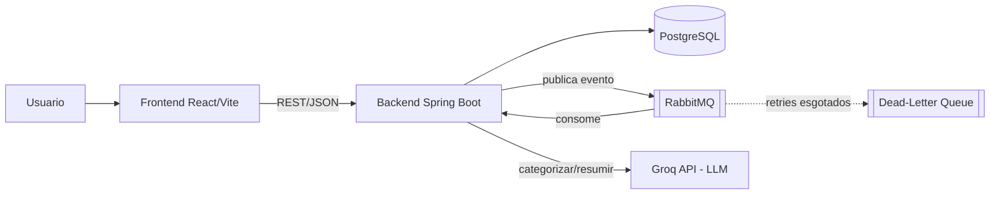

# Portfolio Financas IA

Gestor de financas pessoais que importa extrato bancario em CSV e categoriza
transacoes automaticamente via IA (LLM). Construido seguindo o Blueprint
`BP-2026-07-13-003` (ATHENA OS).

## Stack

- **Backend:** Java 21, Spring Boot 3.5, Spring Data JPA, Flyway, Spring AMQP
- **Banco de dados:** PostgreSQL 16
- **Mensageria:** RabbitMQ 3.13 (categorizacao assincrona via IA, fase E-4)
- **Frontend:** React 19 + TypeScript + Vite, CSS Modules (sem bibliotecas de
  UI/HTTP externas — `fetch` nativo)

## Arquitetura



Fluxo: o import de um extrato CSV persiste as transacoes de forma sincrona
e publica um evento por transacao na fila (`TransactionsImportedEvent`); um
consumer separado chama a Groq API para categorizar cada uma de forma
assincrona, com retry exponencial e fallback para uma DLQ inspecionavel via
endpoint admin. O resumo mensal em linguagem natural tambem passa pela
mesma API de LLM, cacheado em `MonthlySummary` para nao re-gerar a cada
request.

### Decisoes tecnicas justificadas

1. **Categorizacao assincrona via fila, com retry + DLQ** (`T-4.3.1`/`T-4.3.2`)
   — evita que a latencia de uma chamada de rede ao LLM (segundos, sujeita
   a rate limit) trave o import de um extrato com dezenas/centenas de
   transacoes, e evita que uma falha do LLM na transacao N invalide as
   demais. Detalhe completo, incluindo o que acontece quando o LLM falha
   depois de esgotar as tentativas: [ADR-002](docs/adr/002-categorizacao-assincrona.md).
2. **Modelo de dados** (`T-1.2.1`) — normalizacao de categoria como
   entidade propria (nao enum/string livre), permitindo categorias
   customizadas pelo usuario e reuso pela IA sem migration. Detalhe:
   [ADR-001](docs/adr/001-modelo-dados.md).
3. **Parser de CSV tolerante em vez de biblioteca terceira** (`T-2.1.2`,
   ver `CsvTransactionParser`) — extratos bancarios reais variam em
   separador (`,`/`;`) e formato de data (`dd/MM/yyyy` vs `yyyy-MM-dd`) sem
   seguir RFC 4180 a rigor (sem campos entre aspas). Um parser proprio e
   pequeno, com limitacoes documentadas em codigo, evitou trazer uma
   dependencia pesada para um formato simples — trade-off consciente: nao
   cobre CSV com campos entre aspas contendo o separador, nem separador de
   milhar.
4. **Frontend sem bibliotecas de UI/HTTP externas** (`T-3.1.1`) — `fetch`
   nativo e CSS Modules em vez de um design system ou client HTTP (ex.:
   axios, TanStack Query). Escopo do projeto (portfolio, 3 telas) nao
   justificava a curva de configuracao extra; trade-off reavaliavel se o
   frontend crescer em numero de telas/estado compartilhado.

## Estrutura do repositorio

```
portfolio-financas-ia/
├── docker-compose.yml       # Postgres + RabbitMQ locais
├── backend/                 # Spring Boot (Maven)
│   └── src/main/java/com/portfolio/financas/
│       ├── transaction/     # import, CRUD e categorizacao manual (E-2)
│       ├── category/        # CRUD de categorias (E-2)
│       ├── summary/         # agregacoes de gasto por mes (E-2)
│       ├── ai/               # categorizacao e resumo via LLM (E-4)
│       └── messaging/       # producer/consumer RabbitMQ (E-4)
├── frontend/                 # React + Vite + TypeScript
│   └── src/
│       ├── pages/            # telas (Upload, Transacoes, Dashboard — E-3)
│       └── components/       # componentes reutilizaveis (E-3)
└── docs/
    ├── adr/                  # Architecture Decision Records
    └── openapi.yaml          # contrato de API
```

## Pre-requisitos

- Docker + Docker Compose
- Java 21 (JDK)
- Maven 3.9+ (ou use o wrapper `./mvnw` incluso em `backend/`)
- Node.js 20+ e npm 10+

## Setup local

### 1. Subir infraestrutura (Postgres + RabbitMQ)

```bash
docker-compose up -d
```

- Postgres disponivel em `localhost:5433` (db `financas_ia`, user/senha `financas`/`financas`) -- porta 5433, nao a padrao 5432, para nao conflitar com um Postgres nativo eventualmente instalado na maquina do desenvolvedor
- RabbitMQ AMQP em `localhost:5672`, management UI em [http://localhost:15672](http://localhost:15672) (user/senha `guest`/`guest`)

Para derrubar os containers preservando os volumes:

```bash
docker-compose down
```

### 2. Rodar o backend

```bash
cd backend
./mvnw spring-boot:run
```

A API sobe em `http://localhost:8080`. As migrations Flyway sao aplicadas
automaticamente no startup contra o Postgres do `docker-compose.yml`.

Para compilar sem rodar:

```bash
cd backend
./mvnw -q compile
```

### 3. Rodar o frontend

```bash
cd frontend
npm install
npm run dev
```

O frontend sobe em `http://localhost:5173` (padrao do Vite).

## Status do projeto

Este repositorio esta sendo construido de forma incremental via Blueprint
ATHENA OS. Fases E-1 (Fundacao), E-2 (Backend Core), E-3 (Frontend) e E-4
(IA + Mensageria) tem o codigo completo e verificado ponta a ponta contra
infraestrutura real (docker-compose + chave real da Groq API): import de
CSV, categorizacao automatica assincrona via LLM, resumo mensal em
linguagem natural com cache, e fila com retry/dead-letter queue.

CP-4 (o checkpoint humano mais critico do blueprint) foi resolvido com uma
ressalva: o operador delegou a revisao/defesa tecnica da camada de IA e
mensageria, entao a justificativa formal (por que e assincrono, o que
acontece quando o LLM falha) esta documentada em
`docs/adr/002-categorizacao-assincrona.md` em vez de internalizada pelo
operador (ver `.planning/STATE.md` para o detalhe).

E-5 (testes automatizados + CI) tambem esta completo: testes unitarios para
as camadas que so tinham cobertura indireta, testes de integracao com
Testcontainers (Postgres + RabbitMQ reais, nao mockados) cobrindo import de
CSV, CRUD de categoria e o fluxo completo de retry/dead-letter queue, e um
pipeline GitHub Actions (`.github/workflows/ci.yml`) para backend e
frontend -- [CI verde e confirmado](https://github.com/garciaggf2407/portfolio-financas-ia/actions).
Rodar os testes de integracao pela primeira vez contra infraestrutura real
de CI (nao so localmente) encontrou 2 bugs reais de producao (categoria
sem `criado_em`, parsing de timestamp na dead-letter queue) alem de bugs
de configuracao do proprio pipeline -- ver `.planning/STATE.md` (CP-5)
para o detalhe de cada um.

E-6 (deploy publico + documentacao final) esta completo. Demo publica no ar:

- Frontend: https://portfolio-financas-ia.vercel.app
- Backend: https://financas-ia-api.onrender.com (`/actuator/health`)

Infra gerenciada: Neon (Postgres), CloudAMQP (RabbitMQ), Render (backend,
via `render.yaml` + Docker multi-stage -- Render nao tem runtime nativo
Java), Vercel (frontend). Passo a passo completo em
[`docs/DEPLOYMENT.md`](docs/DEPLOYMENT.md).

Dois bugs reais so apareceram testando a demo publica com dado de verdade
(nao apareciam em dev local nem nos testes automatizados):

1. **Parser de CSV so aceitava 3 colunas em ordem fixa** -- o export real
   do Nubank tem 4 colunas em ordem diferente
   (`Data,Valor,Identificador,Descrição`). Corrigido para mapear colunas
   por nome quando ha header reconhecivel, mantendo o layout posicional
   como fallback (retrocompativel).
2. **Backend "sumia" por ~80s na primeira requisicao do dia** -- o Render
   free tier hiberna o servico apos inatividade. Mitigado com um ping
   periodico via GitHub Actions (`.github/workflows/keep-warm.yml`,
   08h-20h BRT) e um aviso na UI quando a requisicao demora.

## Documentacao

- [`docs/adr/001-modelo-dados.md`](docs/adr/001-modelo-dados.md) — decisoes
  do modelo de dados financeiro (adicionado em E-1/T-1.2.1)
- [`docs/adr/002-categorizacao-assincrona.md`](docs/adr/002-categorizacao-assincrona.md) —
  por que a categorizacao via IA e assincrona (fila) e o que acontece
  quando o LLM falha (retry + dead-letter queue), adicionado em E-4/T-4.3.2
- [`docs/openapi.yaml`](docs/openapi.yaml) — contrato de API (adicionado em
  E-1/T-1.2.3)
- [`docs/DEPLOYMENT.md`](docs/DEPLOYMENT.md) — guia de deploy publico
  (Render + Neon + CloudAMQP + Vercel), adicionado em E-6/T-6.1.1
